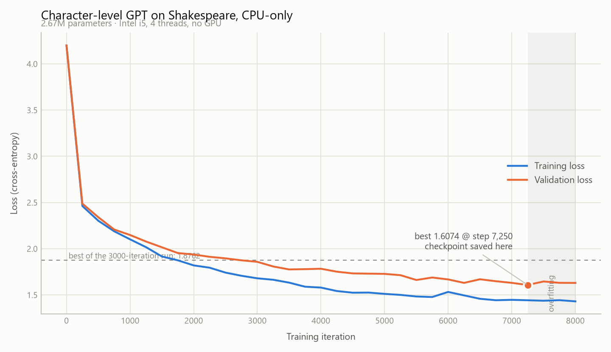

# llm-experiments

Training a small character-level GPT on Shakespeare, **CPU-only**, on modest hardware
(Intel i5, 8 GB RAM, no GPU).

Two runs of the same 2.67M-parameter model, differing only in training length.

## Results

| | 3000 iterations | 8000 iterations |
| --- | --- | --- |
| **Best validation loss** | **1.8762** | **1.6074** |
| Training loss at end | 1.7134 | 1.4306 |
| Best checkpoint at step | 3000 (final) | **7250** (not the final step) |
| Wall time | ~11 min | ~30 min |
| Peak RAM | ~410 MB | ~410 MB |
| Time per iteration | ~200 ms | ~200 ms |

Starting loss for both was 4.1993 — random guessing across a 65-character vocabulary.

<picture>
  <source media="(prefers-color-scheme: dark)" srcset="loss_curve_dark.png">
  
</picture>

Regenerate with `python scripts/plot_loss.py train_8k.log loss_curve`.

### The longer run peaked before it ended

Validation loss bottomed out at step 7250 and got *worse* afterwards:

| Step | Train | Val | |
| --- | --- | --- | --- |
| 5500 | 1.4831 | 1.6616 | |
| 6250 | 1.4950 | 1.6303 | |
| 7000 | 1.4468 | 1.6305 | |
| **7250** | 1.4422 | **1.6074** | best — checkpoint saved |
| 7500 | 1.4373 | 1.6456 | worse, not saved |
| 7750 | 1.4431 | 1.6308 | worse, not saved |
| 8000 | 1.4306 | 1.6299 | worse, not saved |

Training loss kept falling while validation loss rose — textbook overfitting on a dataset
of only 1.1M characters. `always_save_checkpoint = False` handles this automatically: a
checkpoint is written only when validation loss improves, so the saved model is the one
from step 7250, not the degraded final state.

The train/val gap widened from 0.00 at step 0 to 0.17 by the end.

## Sample output

3000 iterations ([sample_output.txt](sample_output.txt)):

```
CLOUCESTER:
Now love
To prove conters, was upon off this gove but him.
```

8000 iterations ([sample_output_8k.txt](sample_output_8k.txt)):

```
CLARENCE:
Now me, my lords, I am not set be the wind to service.

COMINIUS:
Peace, to bloody, but unto our worsting;
What's him better me for the laces upon.
```

The difference is clearest in the names. The shorter run invented Shakespeare-*shaped*
nonsense: `CLOUCESTER`, `GORCET`, `PAREET`. The longer run produces real, correctly
spelled characters — `CLARENCE`, `ISABELLA`, `AUTOLYCUS`, `POLIXENES`, `WARWICK`,
`CORIOLANUS`, `Second Citizen` — and most individual words are real English. Sentences
still don't mean anything, which is expected at this scale.

## Prompting the model

[scripts/talk.py](scripts/talk.py) loads the best checkpoint and continues whatever you
type:

```bash
python scripts/talk.py
python scripts/talk.py --temperature 0.6 --tokens 300
```

It is **not** a chatbot — it was trained only to predict the next character, so it
continues your text rather than answering it. Give it a speaker name or the start of a
line:

```
you> ROMEO:

Second Grent:
I shall faith, and cause to the dost bring of you.
Come, my name? I am but dring depossition
```

The model knows only the 65 characters in its training data; anything else (digits,
most punctuation) is dropped with a warning. `--temperature` controls randomness:
below 0.8 is more repetitive and safer, above is wilder.

## Configuration

- [configs/train_shakespeare_char_cpu.py](configs/train_shakespeare_char_cpu.py) — 3000 iterations
- [configs/train_shakespeare_char_cpu_8k.py](configs/train_shakespeare_char_cpu_8k.py) — 8000 iterations

Model: 6 layers, 6 heads, embedding size 192, block size 64, batch size 12, dropout 0.2.

Three nanoGPT defaults must be overridden to train on CPU:

- `gradient_accumulation_steps = 1` — nanoGPT defaults to **40**, making every iteration
  40x slower.
- `dtype = 'float32'` — nanoGPT defaults to `float16` precisely when no GPU is found,
  which behaves badly on CPU.
- `eval_iters = 20` — the default of 200 spends more wall time measuring than training.

Plus `device = 'cpu'` and `compile = False` (torch.compile is unreliable on Windows CPU).

## Reproducing

Requires Python 3.12.

```bash
python -m venv .venv
.venv\Scripts\Activate.ps1
pip install torch --index-url https://download.pytorch.org/whl/cpu
pip install -r requirements.txt

git clone https://github.com/karpathy/nanoGPT.git
copy configs\train_shakespeare_char_cpu_8k.py nanoGPT\config\
cd nanoGPT
python data\shakespeare_char\prepare.py
python train.py config/train_shakespeare_char_cpu_8k.py
python sample.py --out_dir=out-shakespeare-char-cpu-8k --device=cpu
```

The `--index-url` matters: the default PyTorch package bundles ~2.5 GB of NVIDIA GPU
libraries that are useless without a GPU. The CPU index is a 122 MB download.

nanoGPT itself is not committed here — it is upstream code with its own history.

## Environment

| Package | Version |
| --- | --- |
| Python | 3.12.10 |
| torch | 2.13.0+cpu |
| numpy | 2.5.1 |
| matplotlib | 3.11.1 |

## Credit

Model code from [karpathy/nanoGPT](https://github.com/karpathy/nanoGPT) (MIT).
